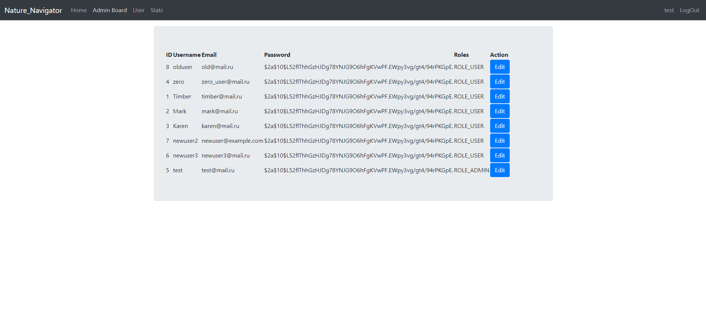

# Описание проекта
Веб-приложение реализовано с помощью Spring(java) и с помощью React, а также использовался Bootstrap для красивого оформления и модального окна.

## Домашняя страница с отображением списка отелей

## Таблица пользователей с кнопками изменение доступная только админам в AdminBoard

## После put запроса изменяются данные сразу и в приложении react и не делается get запроса

## В компоненте HotelRepository делаем join таблиц отелей и историй посещений отелей для получения статистики

## Вывод статистики

## Вывод контента для обычных пользователей

## Вывод информации о профиле

## Страница логина

## Страница регистрации

